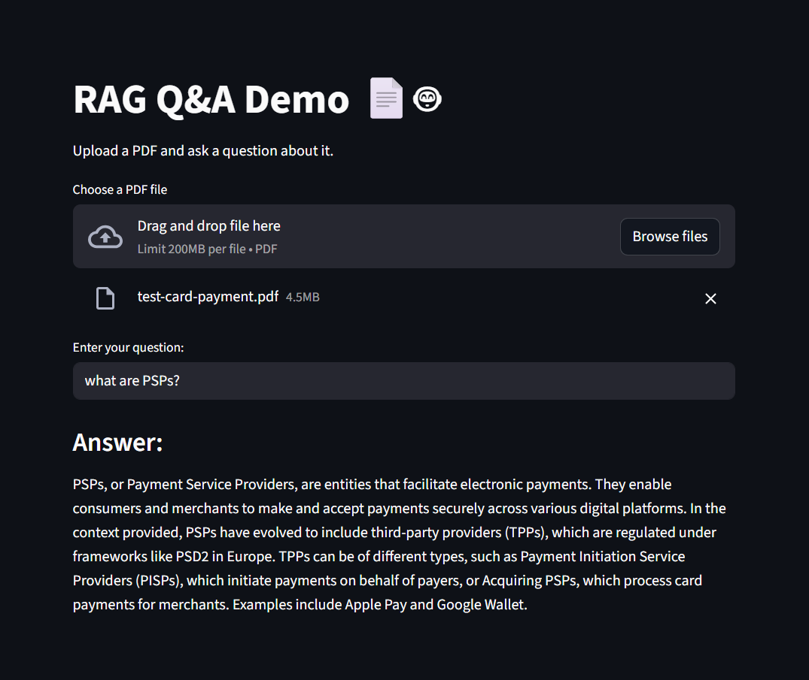

# RAG PDF Q&A App 📄🤖

A simple Retrieval-Augmented Generation (RAG) prototype built with Streamlit.  
Upload a PDF, ask natural language questions, and get AI-generated answers using context from the document.

---

## ✨ Features
- PDF ingestion and text extraction (PyPDF)
- Sentence-based text chunking (NLTK)
- Embedding generation (OpenAI API)
- Cosine similarity search for relevant chunks
- Streamlit UI for easy interaction

---

## 🔑 Environment Variables

This project requires an OpenAI API key.

1. Create a file named `.env` in the project root.
2. Add the following line (replace with your own API key):
*OPENAI_API_KEY=your_api_key_here*

3. The app will automatically load the key from this file.

---

## 🚀 How to Run

1. Clone the repo:
   ```bash
   git clone https://github.com/YOURUSERNAME/RAG-Streamlit-App.git
   cd RAG-Streamlit-App
   ```

2. Create & activate a virtual environment:
   ```bash
   python -m venv venv
   source venv/bin/activate   # Mac/Linux
   venv\Scripts\activate      # Windows
   ```

3. Install requirements:
   ```bash
   pip install -r requirements.txt
   ```

4. Download NLTK data (only needed once):

   ```python
   import nltk
   nltk.download('punkt')


5. Run the app:
   ```bash
   streamlit run app.py
   ```

---

## 📷 Screenshot


---

## 📚 What I Learned
- How to build a basic RAG pipeline without LangChain or a vector DB
- Practical understanding of embeddings, chunking, and similarity search
- End-to-end prototype development with Streamlit

---

## 🛠️ Tech Stack
- **Python** (NLTK, NumPy, PyPDF)
- **Streamlit** for UI
- **OpenAI API** for embeddings + answers
